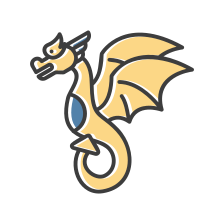

<p align="center">
  
</p>

##

<h2 align="center">Kayquews • Full Stack Developer 🚀</h2>
<p align="center">
  <b>React • Python • PHP</b><br>
  Interfaces modernas, APIs RESTful, automação e boas práticas.<br>
  <a href="https://www.linkedin.com/in/kayque-wallace-da-silva-534806261/?originalSubdomain=br">
    
  </a>
  <a href="https://github.com/Kayquews">
    
  </a>
</p>

##

## Troféus do GitHub

<div align="center">
  
</div>


# Oie, seja bem-vindo(a) 👋

- 🔭 Sou um desenvolvedor apaixonado por tecnologia!
- 😄 Pronome: ele/dele KayqueWs
- ⚡ Fun fact: Adoro memes e café! ☕
- 🌱 Atualmente aprendendo mais sobre desenvolvimento web e mobile.
- 💬 Pergunte-me sobre JavaScript, Python e React!
---
# Sobre mim

> Sou desenvolvedor full stack, focado em construir soluções eficientes com React, PHP e Python. Busco aprimorar continuamente minhas habilidades, colaborando em projetos desafiadores e entregando resultados de qualidade. Valorizo o trabalho em equipe e estou sempre aberto a aprender novas tecnologias e compartilhar conhecimento.

-----------

## 🚀 Projetos em Destaque

- [Bau da Sergipanidade](link) — Breve descrição do projeto, principais tecnologias e impacto.
- 
---

## 💻 Tecnologias & Ferramentas

**Frontend:**  
    

**Backend:**  
  

**Databases:**  
   


**DevTools:**  
    


**Cloud/Deploy:**  
   

---


```js
const skills = [
    "JavaScript",
    "Python",
    "React",
    "Node.js",
    "HTML5",
    "CSS3",
    "PHP",
];
```

---
---

## Snake das Contribuições

<p align="center" style="background:#22242a; border-radius:12px;" >
  
</p>

---